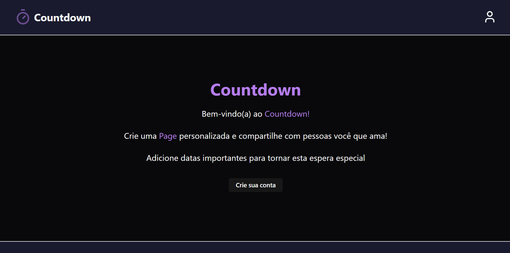

# Fullstack Site Using React with TypeScript on Node.js
 
  
   .
   ### Demo app: https://countdown.nkportfolio.tech
# About
 This project is a countdown app, that let users create custom pages and share with their friends.
 Inside this page you can create events and pick a music from Spotify to customize your page.
 For the frontend I used React and the Backend was made using Node.js with TypeScript.
 This project uses HTTPOnly Signed Cookies and JWT for authentication.
 The API makes the communication between the web page and the database that stores all the data.
 Please, fell free to use all the features moderately.

# Working on
 - [ ] New Features
 - [ ] Tests with JEST on the backend

# Stacks
  ### Back-end
  - TypeScript
  - Node.js
  - Express
  - Prisma
  - MySQL
  - Zod
  - Cookie-Parser
  - Bcrypt
  - JWT
  - Axios
  - Multer
  - Cors
  
  ### Front-end
  - React
  - JavaScript
  - shadcn/ui
  - Tailwind
  - Axios
  - Lucide React
  - Date-fns
  - React-toastify
  
  ### Implantation
  - Website: https://countdown.nkportfolio.tech
  - API: https://countdown-api.nkportfolio.tech

  # Author
   Nicolas Klein Faria de Araujo  
   https://countdown.nkportfolio.tech
